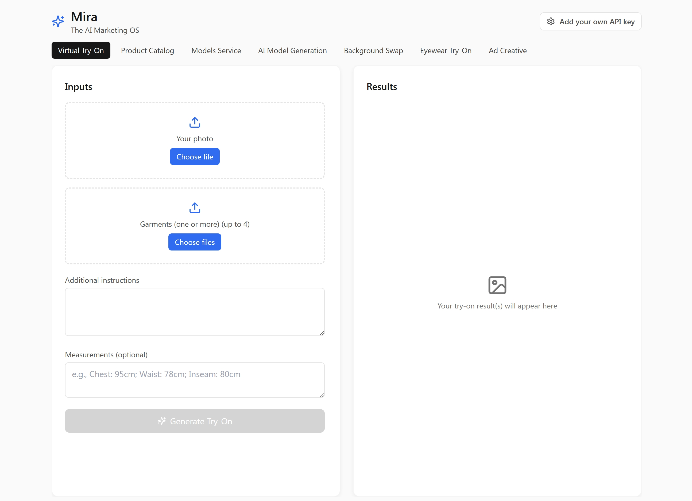

# Mira - The AI Marketing OS

Mira is a comprehensive AI-powered application designed to streamline marketing creative workflows. It integrates advanced generative AI capabilities to help teams create, edit, and manage marketing assets with ease. Built with React, Vite, and Tailwind CSS, it offers a modern, responsive interface for various AI media tasks.



## Key Features

Mira serves as a central hub for several powerful AI tools:

*   **Virtual Try-On**: Visualize clothing on different models.
*   **Product Catalog**: Manage and reference your product assets.
*   **Models Service**: Configure and select AI models for your generations.
*   **AI Model Generation**: Create custom AI fashion models.
*   **Background Swap**: Instantly replace product backgrounds with professional scenes.
*   **Eyewear Try-On**: Specialized visualization for eyewear products.
*   **Ad Creative**: Generate complete ad creatives based on product data.

## Technology Stack

*   **Frontend**: [React](https://react.dev/) + [TypeScript](https://www.typescriptlang.org/)
*   **Build Tool**: [Vite](https://vitejs.dev/)
*   **Styling**: [Tailwind CSS](https://tailwindcss.com/)
*   **Icons**: [Lucide React](https://lucide.dev/)
*   **Routing**: [React Router](https://reactrouter.com/)
*   **AI Integration**: Google Gemini API & OpenRouter

## Getting Started

### Prerequisites

*   Node.js (v18 or higher recommended)
*   npm or yarn
*   A valid API Key from [Google AI Studio](https://aistudio.google.com/) (Gemini) or [OpenRouter](https://openrouter.ai/).

### Installation

1.  Clone the repository:
    ```bash
    git clone https://github.com/yourusername/mira-ui.git
    cd mira-ui
    ```

2.  Install dependencies:
    ```bash
    npm install
    ```

3.  Start the development server:
    ```bash
    npm run dev
    ```

4.  Open your browser and navigate to `http://localhost:5173` (or the port shown in your terminal).

## Configuration

To use the AI features, you need to configure your API key within the application:

1.  Click the **Settings** button (gear icon) in the top-right corner of the app.
2.  Select your preferred **AI Provider** (Google Gemini or OpenRouter).
3.  Enter your **API Key**.
4.  The key is saved locally in your browser, so you don't need to re-enter it every time.

## Project Structure

*   `src/pages`: Individual feature pages (Virtual Try-On, Ad Creative, etc.).
*   `src/components`: Reusable UI components.
*   `src/lib`: core logic, including `ai-engine.ts` (AI integration) and `image-processing.ts`.

## AI Models

Mira is currently optimized to use the **Gemini 3 Pro Image Preview** model for high-quality multimodal generation.
